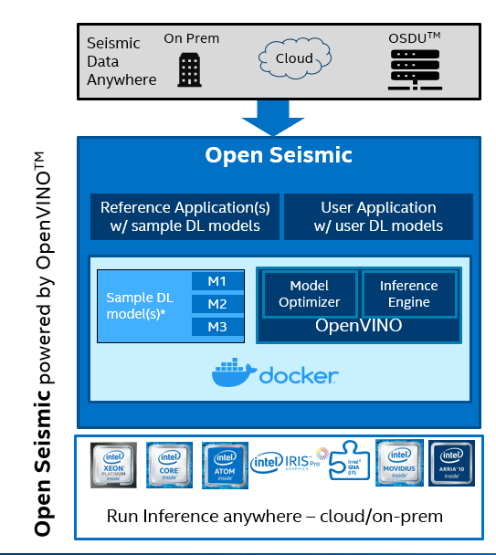

# Open Seismic

## About Open Seismic
Open Seismic is an open source sandbox environment for developers in oil & gas to perform deep learning inference on 3D/2D seismic seismic data. Open Seismic performs deep learning inference for seismic data with optimizations by [OpenVINO™ Toolkit](https://docs.openvinotoolkit.org/latest/index.html). Open Seismic is containerized to run anywhere and includes publicly available reference models for common tasks: [Fault Detection](https://github.com/xinwucwp/faultSeg) , [Salt Identification](https://github.com/waldeland/CNN-for-ASI) , [Facies Classification](https://github.com/yalaudah/facies_classification_benchmark).

## Documentation
Read the full docs on [ReadTheDocs](https://openseismic.readthedocs.io/).

## Architecture 

<div align="center">
  
</div>


## Installation

### Pre-build docker image activilies:
Before start to built docker images or run code local, you need to download some datasets.

You need to install `gdown` python packege to use authomatization downloading script
```
pip3 install gdown==3.12.2
```
To download the required data the the proper path, simply run `setup_dependencies.sh` script

```
./setup_dependencies.sh
```

### Docker
The following command builds the docker image. This is the **recommended** way of installing Open Seismic and will be the default way that this README interacts with Open Seismic.
```
$ docker build . -t open_seismic
```

Notice: if you have proxy please specify it as follows

```
docker build --build-arg http_proxy=http://my-proxy:port --build-arg  https_proxy=http://my-proxy:port . -t open_seismic
```

Then run the demo to make sure all components are installed correctly:
```
docker run -v $PWD/data_mnt:/data_mnt  -v $PWD/runs/:/core/runs  -v $PWD/models/:/core/models/ open_seismic ./run.sh -c models/facies/facies_config.json
```

Notice: If you want to stop a container by name, simply run
```
$ docker stop <container name>
```
You can find `<container name>` using this command:
```
$ docker ps 
```

### Local
You can also choose to install Open Seismic locally. This is **not recommended**, but nonetheless, it is an option.
1. Install Intel's Distribution of OpenVINO. The required version of OpenVINO is **2021.1.110**. Documentation for installation can be found [here](https://docs.openvinotoolkit.org/latest/index.html).
2. Execute the following commands in a terminal window:
```bash
$ python3 -m venv open_seismic
$ source open_seismic/bin/activate
(open_seismic)$ pip install -r ./requirements.txt
$ cd core && ln -s ../models/ models && cd ..
```
Then run the demo to make sure all components are installed correctly:
```bash
$ cd core && ./run.sh -c models/facies/facies_config.json
```

### Next Steps

If you would like to learn more about Open Seismic, please go to our documentation website. If you would like a more interactive learning experience, please go to the `examples/` directory and follow the instructions in the notebooks. If you would like to learn more about models that exist within Open Seismic, please go to `models/demos/` and look in each folder dedicated to demo-ing a model.

In the `examples/` directory, you will find four notebooks:
1. `Example1.ipynb`: This notebook will teach you about converting models to OpenVINO IR.
2. `Example2.ipynb`: This notebook will go over how to define custom preprocessing, postprocessing, and model inference handling scripts.
3. `Example3.ipynb`: This notebook will walkthrough how to use Open Seismic by using an example JSON config file.
4. `Example4.ipynb`: This notebook allows users to rapidly get started with using Open Seismic by editing a couple of variables in the notebook.

In the `models/demos/` directory, you will find three demo notebooks. Each notebook goes over how to utilize the given models in Open Seismic.

## Details for Usage
Needed files:
1. Dataset
2. JSON Config

Files that can be provided for custom processing:
1. OpenVINO Model Initializer, XML, and BIN file
2. Preprocessor Script
3. Postprocessor Script

If an OpenVINO model is not provided, then please choose from a list of given models:

1. FaultSeg
2. Salt
3. Facies

The preprocessing script and postprocessing script are for your benefit, as we provide a way for you to customize inference depending on the filetype of your dataset. If you are using a given model, then check that your dataset filetype is supported by the model.

For datasets with variable shape, expect a slight degredation in performance due to reshaping of the network. For best performance, adhere to a static shape dataset. Async tasks <b>does not allow</b> variable shape.

### JSON Config Structure
```
{
/*
pre_model_optimizer_params:

The pre_model_optimizer_params specify the script path and the script parameters. 
The script.sh file can be used as a conduit for specifying Python scripts. Use 
argparse to ingest the parameters defined after the script. 

*/
    "pre_model_optimizer_params": {
        "script": "path/to/conversion/script.sh", 
        "script_param_1": "...", // param names will be defined by your script
        "script_param_2": "..."  // conversion script must use argparse
    },
    
/*
model_optimizer_params:

The model_optimizer_params section is for specifying model optimizer configuration 
values. Please refer to OpenVINO's documentation for details.

*/
    "model_optimizer_params": {
        "input_model": "path/to/model.ext", // MO params defined by OpenVINO
        "input_shape": "[...]",
        "data_type": "FP32",
        "output_dir": "output_dir/",
        "model_name": "name-of-model"
    },
    
/*
inference_params:

The inference_params section is for specifying inference configurations for Open Seismic. 

*/
    "inference_params": {
        "data": "path/to/data/",
        "model": "path/to/model_files/and/model_scripts/", 
        "infer_type": "<sync/async/cube_sync/cube_async/section_sync/section_async>",
        <"benchmarking": ''>, // skip to disable model benchmarking
        "output": "path/to/output_dir/",
        "streams": "num_streams",
        "slice": "<full/inline/crossline/timeslice>",
        "subsampl": "stride_of_cubed_inference",
        "slice_no": "slice_number",
        "im_size": "side_length_of_cube_for_cubed_inference",
        "return_to_fullsize": "<True/False>"
    },
    
/*
visualize_params:

The visualize_params section are used for specifying the Open Seismic visualization 
configurations. This might be handy if you want to qualitatively analyze the output.

*/
    "visualize_params": {
        "input": "path/to/output_dir/", // == "output" param in "inference_params"
        "output": "vis_folder/", // folder name where to dump outputs
        "model_type": <"facies", "salt", "fault">
    }
}
```

Refer to [here](https://docs.openvinotoolkit.org/latest/openvino_docs_MO_DG_prepare_model_convert_model_Converting_Model_General.html) for information on model optimizer parameters.

### Preprocessor, Postprocessor, and Model Scripts
Preprocessor script should be stored in a folder dedicated to scripts. However, if you have more files that you need to mount, follow the recommended mount directory structure outlined in the next section. In the preprocess script, it must include the function below:

```
def preprocess(data, input_layers, input_shape=(...), model=None):
    ...
    return {input_layer_1: data_1, ..., input_layer_n: data_n}
```

The same can be said of the postprocessor script, if you choose to define one. It must include the function below:

```
def postprocess(output_dict, output_shape=(...)):
    ...
    return {output_layer_1: data_1, ..., output_layer_n: data_n}
```

Lastly, users can define a custom model class to handle custom inference. The model script must include a `model` class. More details for all three scripts can be found in `examples/Example2.ipynb`.

### File Structure
The following file structure is recommended for two reasons:
1. Clear encapsulation of custom scripts and data
2. Easy mounting to docker container. You only need to mount one volume/directory in order to access both the data folder and the custom model script folder.

```
my_local_dir/
    config.json
    my_data_folder\
        ...
        data_file_i
        ...
    my_optimization_folder\
        converter_script.sh
        converter_script_helper.py
    my_scripts_folder\
        model.py
        preprocessor.py
        postprocessor.py
        modelname.xml
        modelname.bin
        modelname.mapping
```

## Model Optimizer
Example:
```
$ docker run -v /abs/path/to/mnt/:/path/to/mnt/ open_seismic /bin/bash executables/mo.sh -h
```

Command above is the help tab, which will give you the arguments that you will need to optimize a mounted model.

## Inference
General Purpose Example (Handling model conversion, optimization, and inference):
```
$ docker run -v $PWD/data_mnt:/data_mnt  -v $PWD/runs/:/core/runs  -v $PWD/models/:/core/models open_seismic  ./run.sh "–c /path/to/config.json"
```

Note above that the file paths in the script options must be from root of the docker container: "/". Recommended file structure is introduced in the earlier part of the README. There are at least three mounts that we must do:
1. Mounting the necessary files for inference
2. Mounting a directory for capturing output
3. Mounting Open Seismic models

This is shown in the example above. For a more interactive experience, please go to the example notebooks and `examples`.

## Visualization

Example:
```
$ infer/exectuables/visualize.sh --input fseg_output --output visualization --model_type fault --slice_no 100
```
Output visualized image will be saved to `path/to/runs/latest_date_folder/visualization/`

Notice: since `visualize.sh` works with the last inference, make sure its type is the same as the visualization type. Also, you must install the Python dependencies outlined in `requirements.txt`.

## Citations
If you use this toolbox or benchmark in your research, please cite the following papers:

```
@article{wu2019faultSeg,
    author = {Xinming Wu and Luming Liang and Yunzhi Shi and Sergey Fomel},
    title = {Fault{S}eg3{D}: using synthetic datasets to train an end-to-end convolutional neural network for 3{D} seismic fault segmentation},
    journal = {GEOPHYSICS},
    volume = {84},
    number = {3},
    pages = {IM35-IM45},
    year = {2019},
}

@article{doi:10.1190/tle37070529.1,
    author = { Anders U. Waldeland  and  Are Charles Jensen  and  Leiv-J. Gelius  and  Anne H. Schistad Solberg },
    title = {Convolutional neural networks for automated seismic interpretation},
    journal = {The Leading Edge},
    volume = {37},
    number = {7},
    pages = {529-537},
    year = {2018},
}

@article{alaudah2019machine,
    title={A Machine Learning Benchmark for Facies Classification}, 
    author={Yazeed Alaudah and Patrycja Michalowicz and Motaz Alfarraj and Ghassan AlRegib},
    year={2019},
    eprint={1901.07659},
    archivePrefix={arXiv},
    primaryClass={eess.IV}
}
```

## Open Seismic Contributors:
- [Christian Reyes](https://github.com/fcr3)
- [Alexey Khorkin](https://github.com/alexeyhorkin)
- [Ravi Panchumarthy](https://github.com/ravi9)
- [Alexey Gruzdev](https://github.com/grib0ed0v)
- [Manas Pathak](https://github.com/manaspathak89)